  

---

### 👋 Hi

我是 **YOUR NAME**，YOUR_SCHOOL 软件工程在读。喜欢终端，也喜欢为终端里的人造工具。

目前在打磨 **[insightful](https://github.com/rizxfrog/insightful)** —— insightfully doing everything.

### 🛠 Stack

`Java` · `Go` · `Python` · `Kotlin` · `TypeScript`

### ⭐ insightful

- 🧠 一个想法驱动的探索型项目
- 🔧 用得顺手比看起来漂亮更重要
- 🤝 欢迎 issue / PR

[**Star →**](https://github.com/rizxfrog/insightful)

---

📫 brightonfermin@gmail.com
